# Remote Containers con VSCode.

Esta herramienta nos permite compartir distintos entornos de aplicaciones o SO sin la necesidad de instalar todos los componentes necesarios en las m�quinas "cliente". El sistema funciona a trav�s de la configuraci�n de Contenedores de Docker que, una vez lanzados, nos "virtualizan" el entorno sobre el propio Docker, incluyendo aplicaciones, extensiones, configuraciones y c�digo fuente.

Existen varias formas de configurar un entorno para que funcione completamente en un entorno de contenedores con VS Code. En general, existen dos escenarios principales para este tipo de desarrollo:

- **Entornos de Deasrrollo Aislados (Stand-Alone Dev Sandboxes)**. Incluso cuando no estamos desarrollando una aplicaci�n para entornos de contenedores, podemos tener la necesidad de aislar el entorno de compilaci�n y tiempo de ejecuci�n de nuestro entorno local, ya sea por incompatibilidad de plataformas, por desarrollar y probar sobre un entorno similar al productivo, para evitar la necesidad de tener mutitud de "frameworks" de desarrollo en local, etc. Un caso t�pico podr�a ser tener una maquina de desarrollo Windows o Mac y estar desarrollando una apliaci�n cuyo entorno final de ejecuci�n se Linux. Otro caso t�pico podr�a ser un equipo que participa en multitud de entornos distintos de desarrollo que pueden exigir distantas versiones de aplicaciones o complementos de desarrollo lo que obiliga a estar constantemente modificando la m�quina de deasrrollo.
- **Aplicaciones de Implementacion en Contenedores**. Si la aplicaci�n que estamos desarrollando est� pensada para ejecutarse en contenedores, lo m�s recomendable es trabajar directamente sobre contenedores con el fin de poder ver las implicaciones que pueda tener al implementarla en producci�n.

## Requerimientos del Sistema.

**Local**

- **Windows**. Docker Desktop 2.0 o superior en Windows 10 Pro/Ent. Docker Toolbox no est� soportado.
- **macOS**. Docker Desktop 2.0 o superior.
- **Linux**. Docker CE/EE 18.06 o superior y Docker Compose 1.21 o superior.

**Containers**. x86_64 Debian 8 o superior, Ubuntu 16.04 o superior, CentOS / RHEL 7 o superior, Contenedores basados en Linux Alpine.

## Instalaci�n del entorno.

1. Instalaci�n de Cliente Docker.
   En base al sistema operativo tendremos que realizar los siguientes pasos:

   **Windows / macOS**.

   1. Instalar [Docker Desktop For Windows/Mac](https://www.docker.com/products/docker-desktop).
   2. Una vez instalado, pulsamos bot�n derecho sobre su icono de la barra de tareas y seleccionamos "Settings / Preferences / Shared Drives / File Sharing". En la pantalla de configuraci�n seleccionamos la unidad o unidades que vamos a utilizar con Docker.

   **Linux**.

   1. Dependiendo de la distribuci�n seleccionada debemos seguir las [instrucciones de instalacion del sitio de Docker](https://docs.docker.com/install/#supported-platforms). En caso de utilizar Docker Compose debemos seguir las instrucciones espec�ficas para [Compose](https://docs.docker.com/compose/install/)
   2. Una vez instalado debemos agregar nuestro usuario al grupo _docker_ utilizando la siguiente linea de comandos: _sudo usermod -aG docker \$USER_
   3. Cerrar sesi�n y volver a logearse para que se apliquen los cambios.

2. Instalar [Visual Studio Code](https://code.visualstudio.com/) o [Visual Studio Code Insiders](https://code.visualstudio.com/insiders/)
3. Instalar pack de [Remote Development Extension](https://aka.ms/vscode-remote/download/extension)

El modo de funcionamiento que se va a exponer ser�a el modo "full-time development environment", donde utilizamos el contenedor y su contenido como entorno de desarrollo completo.

## Configuracion de Docker Remote en VSCode.

Para la puesta en marcha de un nuevo contenedor remoto tenemos distintas opciones que vamos a ver a continuaci�n y que dependen del "punto de partida" de nuestro desarrollo.

#### Utilizar un fichero Dockerfile.

Se configura VSCode para utilizar una imagen existente con origen DockerHub, Azure Container Registry, o de nuestra creaci�n. Para poder utilizar nuestras imagenes o ficheros de configuraci�n de Docker debemos crear, en el mismo directorio de nuestra aplicaci�n, un directorio ".devcontainer" y, dentro de �ste, un fichero "devcontainer.json".

Empezamos por abrir el directorio donde tenemos el proyectos o el fichero "Dockerfile" y, una vez abierto, seleccionamos la opci�n **Remote-Containers: Add Development Container Configuration Files...** (la paleta de comandos la podemos mostrar pulsando F1).

| 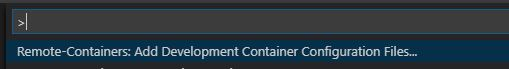 |
| :-------------------------------------------: |


| _Creaci�n de ficheros de configuraci�n de Docker Remote (*F1*)_

Seleccionamos la opci�n **From 'Dockerfile"** para poder indicarle, a posteriori, el fichero Dockerfile de nuestro proyecto.

| 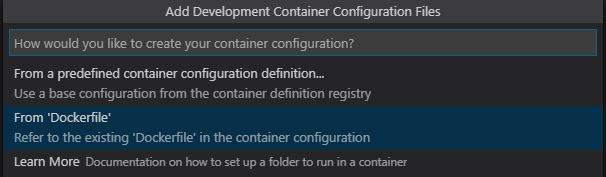 |
| :-----------------------------------------------------------: |


| _Creaci�n de ficheros de configuraci�n de Docker Remote (*F1*) desde Dockerfile_

La herramienta de VSCode nos crea un nuevo directorio en nuestro proyecto con el nombre **.devcontainer** y un nuevo fichero con nombre **devcontainer.json**.

En el nuevo archivo creado (**devcontainer.json**) tenemos una propiedad que, por defecto, VSCode ya nos habr� inicializado con el nombre y ruta de nuestro fichero Dockerfile. Si el nombre o la ruta fueran incorrectos tendremos que modificarlo manualmente para que coincida con nuestra configuracion.

| 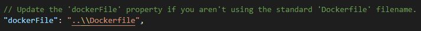 |
| :------------------------------------------------------: |


| _Propiedad para al configuracion de ruta y nombre de fichero Dockerfile._

Otra de las opciones que podemos configurar, dependiendo del SO base de la imagen Docker, es el "shell" que queremos utilizar cuando lancemos la venta "terminal" (como veremos m�s adelante). Esto nos va ha permitir interactuar con el SO del contenedor a trav�s de la consola.

| 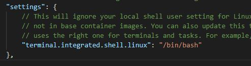 |
| :-------------------------------------------------------: |


| _Propiedad para la configuraci�n del Shell de Linux en SO de contenedor._

Por �ltimo, y para el ejemplo que estamos viendo, donde queremos utilizar un contenedor que nos permita desarrollar sobre la �ltima versi�n de .Net Core, vamos a indicarle a Docker Remote que, una vez que est� levantado el contenedor, nos instale la extensi�n relativa al SDK de desarrollo de .NET Core. Podemos indicarle varias extensiones separandolas por una coma e indicando, como nombre de la extensi�n, la propiedad **unique.identifier** que encontramos en todas las extensiones de VSCode.

| 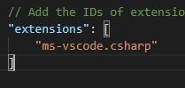 |
| :------------------------------------------------------: |


| _Propiedad para la configuracion de las extensiones a agregar en el contenedor._

Adem�s de las propiedades b�sicas comentadas, el fichero **devcontainer.json** puede tener otras muchas para distintos cometidos, como por ejemplo, definir la publicaci�n de puertos del contenedor, par�metros de inicializaci�n del cliente Docker al lanzar el contenedor, etc. Se puede encontrar una lista de opciones en la su [referencia](https://code.visualstudio.com/docs/remote/containers?WT.mc_id=-blog-scottha#_devcontainerjson-reference).

| 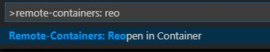 |
| :---------------------------------------------------------: |


| _Reapertura de directorio de proyecto sobre Contenedor Docker._

Una vez que hemos terminado de configurar el archivo para Docker Remote, reabrimos el directorio en el contenedor, para ello, seleccionamos **Remote-Containers: Reopen Folder in Container** en la consola de comandos (_F1_) (tambi�n podemos utilizar **Remote-Containers: Open folder in Container...**).

Cuando finaliza la carga del contenedor, ya podemos comenzar a utilizar nuestro desarrollo sobre Docker Remote. En este caso, por tratarse de una web asp de .Net Core, necesitamos indicarle un puerto local para asociarlo al puerto de entrada del contenedor. Para ello seleccionamos **Remote-Containers: Forward Port from Container** y le indicamos, en este caso, 8090. Ahora ya podr�amos acceder a la aplicaci�n alojada en el contenedor desde nuestro navegador local (http://localhost:8090).

| 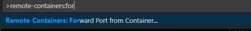 |
| :-------------------------------------------------: |


| _Configuracion de puerto local a puerto del Contenedor para acceso local._

#### Utilizar un proyecto configurado para Docker Remote con VSCode.

Otra opci�n que tenemos a la hora de utilizar Docker Remote desde VSCode ser�a utilizando una configuraci�n existente, con su correspondiente fichero **Dockerfile** y el fichero de configuracion de Docker Remote \*\*\*\*

Un ejemplo ser�a un repositorio (GitHub, GitLab, etc....) donde, adem�s del proyecto de c�digo, disponemos de la confirguraci�n de Docker Remote. Lo �nico que tendr�amos que hacer es clonar el repositorio a un directorio local y, de la misma forma que reabriamos la carpeta de proyecto en el caso anterior, ejecutariamos el mismo procedimiento con el proyecto descaargado, asegurandonos de tener disponible el correspondiente directorio de Docker Remote y su archivo de configuraci�n.

#### Agregra Docker Remote a proyecto sin configuraci�n de contenedor.

La �ltima opci�n que vamos a ver ser�a aquella donde tenemos un poryecto en el cual no tenemos ni la configuraci�n de Docker Remote ni la de Docker (Dockerfile). Con esta opci�n lo que hacemos es convertir un proyecto o directorio para que su ejecuci�n se realize desde un contenedor. En este caso no disponemos de una configuraci�n de contenedor destino por lo que tendremos que establecerla al configurar Docker Remote.

Supongamos que nos hemos levantado con el pie izquierdo, tenemos un dia de kk y decidimos comenzar un proyecto con python. Abrimos la carpeta que lo contine en VSCode y seleccionamos **Remote-Containers: Open folder in Container...** en la consolo de comandos (_F1_).

| 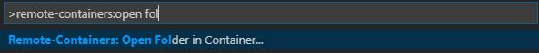 |
| :----------------------------------------------------: |


| _Abrir directorio local en Contenedor._

Como en este caso no tenemos ninguna configuraci�n previa de Docker Remote, VSCode nos ofrece distintas configuraciones preestablecidas para que seleccionemos la m�s adecuada a nuestras necesidades. En caso que ninguna se ajuste a nuestro proyecto o queramos crear una personaliza, simplementes pulsamos enter sin seleccionar ningua de las propuestas. VSCode nos crear� el fichero de configuracion de Docker Remote y nos dejar� a nosotros la tarea de crear el fichero **Dockerfile** necesario para la ejecuci�n del contenedor. Nosotros, en este caso, seleccionamos **Python 3**.

| 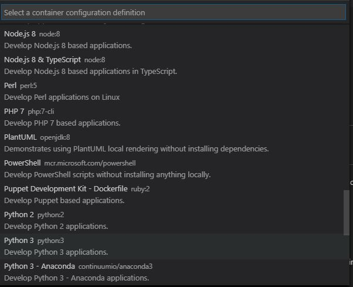 |
| :-----------------------------------------------------------: |


| _Selecci�n de plantilla para la creaci�n de contenedor._

Una vez seleccionado, VSCode se encarga de crear los archivos de configuraci�n, descargar las imagenes Docker necesarias, crear el contenedor y lanzar nuestro proyecto sobre �l.

#### Agregar extensiones a nuestro contenedores.

Como hemos visto, VSCode agrega la configuraci�n necesaria al contenedor y al fichero de Docker Remote para la ejecuci�n de nuestro proyecto en base a la plantilla que seleccionemos. Si queremos agregar nuevas extensiones al proyecto, no es necesario creaarlas en nuestro entorno sino que podemos indicarle a VSCode que solo las agrege a nuestro contenedor remoto. Para hacer esto, editamos el fichero **devcontainer.json** y nos posicionamos en la propiedad **extensions**. Para ver su funcionamiento vamos a agregar una extensi�n que nos muestre el cosnumo de recursos de del contenedor en tiempo real. Para esto, accedemos a la p�gina de la extensi�n [Resource Monitor](https://marketplace.visualstudio.com/items?itemName=mutantdino.resourcemonitor) y buscamos su propiead **Unique Identifier**, copiamos su valor (mutantdino.resourcemonitor) lo agregamos a la propiedad **extensions**

| 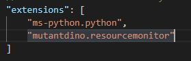 |
| :-----------------------------------------------------: |


| _Agregando extension "Resource Monitor" a contenedor de Python3._

Como esta propiedad no estaba cuando se creo el contenedor, necesitamos que VSCode reconstruya el contenedor. Para esto, seleccionamos la opci�n **Remote-Containers: Rebuild Containers** en la consola de comandos (_F1_).

| 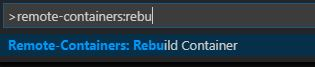 |
| :---------------------------------------------: |


| _Rebuild de contenedor._

VSCode realiza "Rebuild" de nuestro contenedor y vuelve a abrir Remote Docker. Ahora, en la barra de estado de VSCode podemos ver, en tiempo real, el consumo de recursos del contenedor.

- Indicar opciones de ventana de Termial. \*

# Telepresence.

Telepresence es una herramienta open source que permite ejecutar servicios de forma local conectando dicho servicio a un cluster de Kubernetes. Esto permite trabajar en local con, por ejemplo, un microservicio, mientras que la infraestructura utilizada para el resto de servicios dependientes se ejecuta en Kubernetes.

Telepresence nos permite hacer desarrollo en local incluso si el servcio que con el que estamos trabajando depende de terceros servicios en Kubernetes, lo que nos permite visualizar de forma rápida y sin despliegues, los cambios realizados en local sobre la estructura de servicios remotos. Teniendo en cuenta que estamos utilizando la máquina de desarrollo, podemos utilizar cualquier herramienta de depuración, test, logging, etc., sin la necesidad de realizar un despliegue en Kubernetes y, todo esto, desde nuestro IDE de desarrollo.

Además de poderlo utilizar con Kuberntes, Telepresence se puede utilizar con OpenShift.

Estas características de Telepresence podrían ser, hasta cierto punto, realizadas desde el propio Kubernetes a través de la redirección de puertos, ya sea con "Port Forwarding" o a través de "proxy" (éste último indicado para tráfico HTTP). La problemática de realizar a través de "túneles" es, por un lado, el mantenimiento de la configuración necesaria de Kubernetes para mantener dichos "túneles" y, por otro lado, la problemática que puede surgir con los tiempos máximos de espera en las conexiones abiertas desde Kubernetes que, en la mayoría de casos con los proveedores online, son de minutos. En algunos casos, y dependiendo de las conexiones disponibles entre el cluster de Kubernetes y el equipo remoto, la experiencia de usuario puede llegar a ser muy lenta.

## Compatibilidad con Windows.

En la versión actual de Telepresence (0.103) la recomendación es utilizarlo a través de Windows Subsystem for Linux (WSL). Esto permite utilizarlo compartiendo los ficheros de nuestra solución a través del sistema de archivos de Windows ya que, en las últimas versiones de WSL (2) Windows pone a nuestra disposición la estructura de carpetas windows en Linux. Las limitaciones en Windows con WSL son las siguientes:

- No permite la creación de volúmenes locales.
- Unicamente acepta la utilización del método "inject-tcp".
- No permite realizar modificaciones sobre los binarios locales que nos vincula Telepresence pero si podemos hacer la modificación en local y, a posteriori, lanzar Telepresence para probar los cambios en el servicio conectado a Kubernetes.

# Remote Containers & Telepresence.

Remote Containers nos permite abrir proyectos en local a través de un contenedor o grupo de contenedores que contienen todo lo necesario para trabajar con dicho proyecto, evitando la necesidad de tener todo el entorno de desarrollo en la máquina local. Existen escenarios donde, ya sea por el número de contendores de la solución o por el tamaño de los mismos (bases de datos, por ejemplo), abrir estos entornos en local puede requerir máquinas locales con una gran cantidad de recursos y rendimiento (memoria, disco, cpu, etc.). Si estos entornos están funcionando, por ejemplo, en Kubernetes, podemos hacer que Telepresence nos evite la necesidad de lanzar toda la solución en local y únicamente abrir el servicio en el que queremos trabajar.

Si podemos utilizar Telepresence desde Remote Containers evitaríamos la necesidad de tenerlo instalado en local y las restricciones existentes en Windows, simpre que el contenedor sea Linux. Además, hacemos que cada uno de los proyectos alojados en estos contenedores se puedan editar, ejecutar y depurar contra otros servicios Kubernetes con independencia del sistema operativo de la máquina de desarrollo.

## Ejemplo de Remote Containers junto con Telepresence.

Imaginemos que tenemos un entorno de Kubernetes en el que tenemos varios servicios funcionando con dependencias entre ellos o como parte de una misma solución. En el ejemplo adjunto contamos con dos proyectos, por un lado, un cliente web Blazor y, por otro lado, una "API" gRPC encargada de servir las operaciones CRUD de la entidad "usuarios".

Para este ejemplo vamos utilizar Windows tanto para el entorno de desarrollo como para la alojar los contenedores y el cluster de Kubernetes. Tanto para los contenedores como Kubernetes utilizaremos "Docker Desktop", activando la opción de Kubernetes.

| 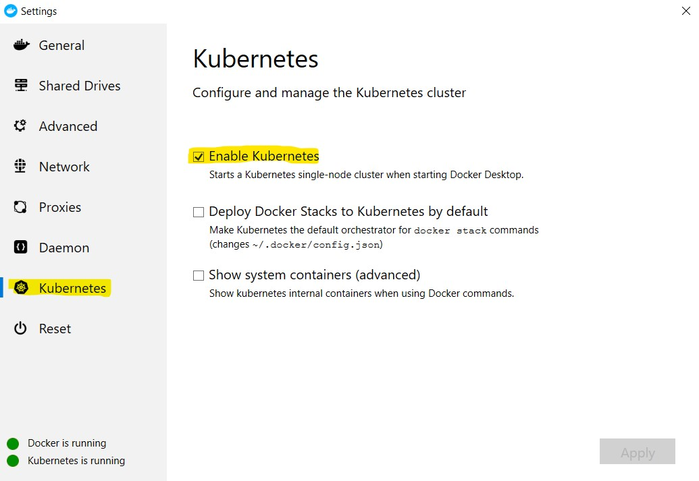 |
| :--------------------------------------------------: |


| _Activación de Kubernetes en Docker Desktop._

### Creando imágenes locales.

Debido a que Docker Desktop configura Kubernetes con el mismo contexto (docker-desktop) podemos crear las imágines de los proyectos de ejemplo en local a través del cliente docker. En los ejemplos aprecen dos archivos de tipo "dockerfile" para el proyecto "UserBlazor":

- _Dockerfile_prod_. Contiene la configuración del contenedor para Kubernetes, donde se realiza la compilación del proyecto y se utiliza la versión más reducida de sistema para su publicación.
- _Dockerfile_tele_. Contiene la configuración del contenedor para su utilización con Remote Containers. Además, incluye los artefactos necesarios para desarrollo, los clientes de docker y Kubernetes, telepresence y la copia del archivo de configuración de Kubernetes para su uso con Telepresence.

Lanzamos la creación de las imágenes desde el directorio de cada projeto. En el caso de "UserBlazor" necesitamos utilizar el fichero "Dockerfile_prod", por lo que para ejecutar el siguiente comando lo renombramos por "Dockerfile.":

```powershell
..\UserBlazor>docker build -t userblazor .
```

Este comando nos crea la imagen "userblazor" en local. Ahora vamos a generar la imagen del proyecto "UserServices":

```powershell
..\UserServices>docker build -t userservices .
```

Una vez lanzada la creación de ambas imágenes comprobamos que se han creado correctamente:

| 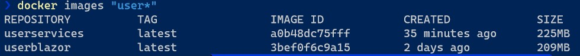 |
| :---------------------------------------------: |


| _Listado de imágenes docker con nombre "user_".\*

### Despliegue en Kuberntes.

Una vez que disponemos de las imágenes creadas en nuestro equipo, podemos proceder a realizar el despliegue en nuestro Kubernetes local:

```powershell
..\UserBlazor>kubectl apply -f Kube_UserBlazor.yaml
```

```powershell
..\UserServices>kubectl apply -f Kube_UserServices.yaml
```

Una vez ejecutados ambos scripts tendremos desplegados ambos servicios como "services", "deployments" y "pods".

| 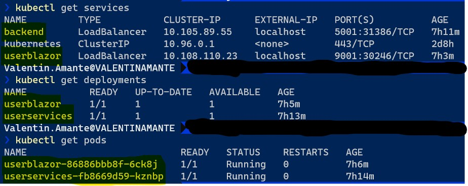 |
| :-----------------------------------------------: |


| _Detalle de componentes creados en Kubernetes para UserBlazor y UserServices (backend)._

> En el caso de utilizar Kubernetes fuera de Docker Desktop (minikube, k8s, etc) y en local, será necesario modificar los archivos ".yaml" de cada proyecto ya que, a fecha de creación de estas pruebas, no se puede utilizar servicios de tipo "LoadBalancer". Hay varias alternativas para su configuración, desde la publicación directa de cada uno de los "pods" a la configuración de servicios tipo "NodePort" o "Ingress".

Como se puede ver en la imagen, tenemos acceso a cada uno de los servicios a través de "localhost" más los puertos 9001 para "frontend" y 5001 para "backend". Para comprobar su funcionamiento abrimos un navegador a la Url del frontal [UserBlazor](http://localhost:9001).

| 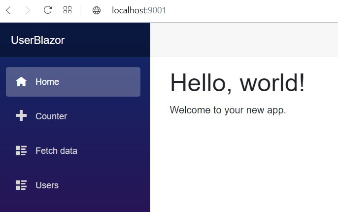 |
| :----------------------------------------------------: |


| _Site de proyecto UserBlazor desplegado en Kubernetes._

Para comprobar que nuestro servicio "UserBlazor" tiene conexión con el servicio "UserServices" tenemos que seleccionar la opción "Users" del menú de la izquierda, que es el que realiza las llamadas al servicio para las operaciones CRUD con la entidad "usuarios".

| 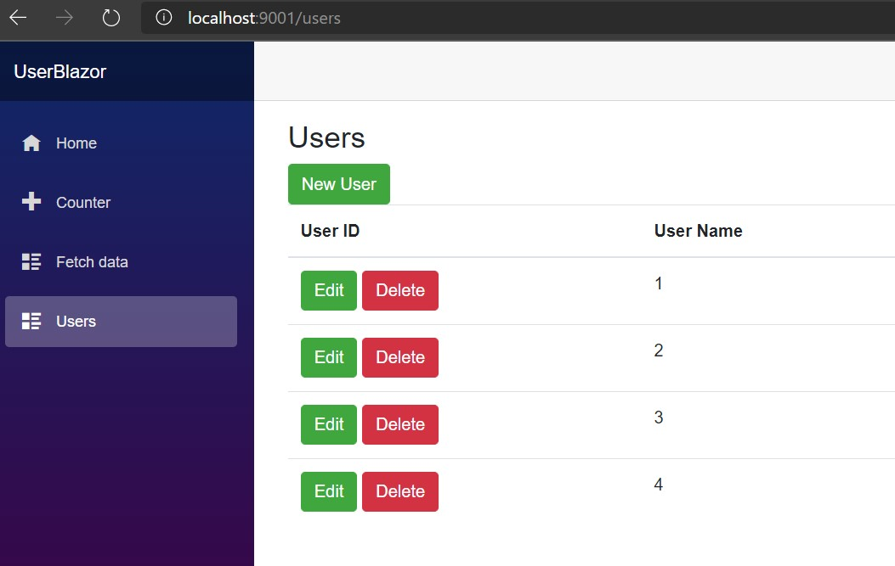 |
| :---------------------------------------------------: |


| _Pagina de Gestión de Usuarios en servicio UserBlazor._

### Utilizando Remote Containers y Telepresence.

Ahora que los dos servicios están desplegados en Kuberntes podemos iniciar nuestros servicios en local y conectarlos a Kuberntes a través de Telepresence. Para este ejemplo utilizaremos el servicio "UserBlazor" para realizar las pruebas de conexión desde Telepresence.

Lo primero que hacemos es lanzar VSCode sobre la carpeta de proyecto de "UserBlazor". Al hacerlo, VSCode detecta la configuración de "Remote Containers" y nos pregunta si deseamos abrir el proyecto sobre el contenedor configurado.

| 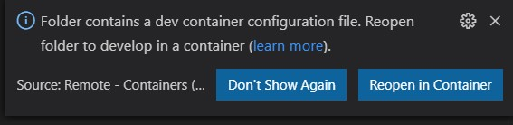 |
| :-----------------------------------------------------: |


| _Detección de configuración de Contenedor en VSCode._

Una vez que tenemos abierto el proyecto en el contenedor, ya podemos lanzar ejecutar el proyecto desde el contenedor ejecutando el siguiente comando desde una consola de terminal (recordar que podemos iniciar una nueva consola desde el menú "Terminal" de VSCode):

```powershell
dotnet run
```

El resultado debería ser la puesta en marcha del servicio a través de Kestrel, mostrandonos la siguiente información:

| 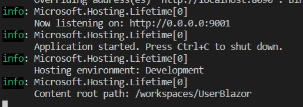 |
| :-----------------------------------------------------------------: |


| _Ejecución de Servicio "UserBlazor" en Kestrel._

En estos momentos tenemos dos servicios "UserBlazor" corriendo, uno desde nuestra instancia de VSCode y otro desde Kubernetes local lanzado anteriormente. En este caso, las peticiones que hagamos a "localhost:9001" nos las sirve el servicio desde Kubernetes y lo que queremos conseguir es que dichas peticiones sean redirigidas a nuestro servicio local sin que el resto de servcios de Kubernetes se vean afectados, lo que nos permitiría sustituir únicamente el servicio seleccionado. Para realizar esto vamos a indicarle a Telepresence que realice la configuración necesaria para que esto se produzca.

Desde VSCode abrimos un nuevo "Terminal" y ejecutamos el siguiente comando:

```bash
telepresence --swap-deployment userblazor --expose 9001 --run-shell
```

Una vez ejecutado Kubernetes mandará todas las peticiones del servicio "UserBlazor" hacia nuesto equipo, pudiendo realizar cualquier acción sobre el proyecto que se verá reblejado en los resultados de la petición. Con el fin de comprobar el funcionamiento y a modo de ejemplo, vamos a modificar el texto "Hello, world!" por "Hello, Telepresence!" en la página "Index":

| 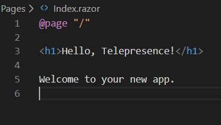 |
| :---------------------------------------------------------: |


| _Cambio de texto en página principal Index_

Una vez modificada la página y guardada, reiniciamos el servicio desde la ventana Terminal donde teníamos lanzado Kestrel (Ctrl+c para pararlo y volvemos a ejecutarlo). Ahora, si navegamos a "localhost:9001" podremos ver que lo que realmente nos está serviendo Kubernetes es nuestro proyecto local:

| 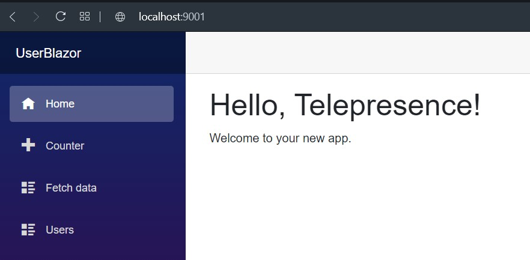 |
| :---------------------------------------------------------------------: |


| _Vista de la página principal del servicio UserBlazor local redireccionada desde Kubernetes_
